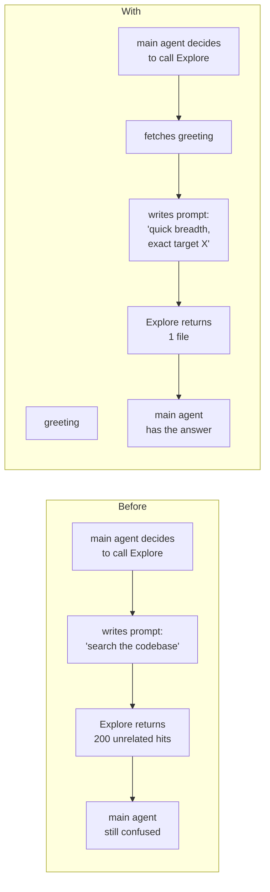

# subagent-greet

Per-subagent calling guidance for Claude Code.

## Why

When the main agent delegates to a subagent, the prompt it passes is the only lever it has — and the only thing it has to write that prompt from is the subagent's `description`. But `description` is always loaded in context (so it must stay short) and its job is to tell the main agent **when** to call the subagent, not **how**. Stuffing HOW-guidance into `description` pays that context cost every session, even when the subagent never gets called.

`subagent-greet` adds a `greeting:` YAML field that loads on demand — only when the main agent is about to delegate to that specific subagent:



## What it ships

- **Skill** (`subagent-greet`) — instructs the main agent to fetch a greeting before each `Agent` tool call.
- **SessionStart hook** — nudges the main agent to use the skill (re-fires on resume, clear, and post-compact).
- **Script** (`subagent-greet.sh`) — resolves the subagent id, parses the YAML `greeting:`, falls back to curated defaults for built-in agents (`Explore`, `Plan`, `general-purpose`, `claude-code-guide`, `statusline-setup`, `research-analyst`).

## Install

```
/plugin marketplace add WillNess210/subagent-greet
/plugin install subagent-greet@subagent-greet
```

## Use it in your own subagent files

Add a `greeting:` block to any agent at `~/.claude/agents/<id>.md` or `<project>/.claude/agents/<id>.md`:

```yaml
---
name: my-agent
description: Short, always-loaded description.
greeting: |
  Required inputs: <list>.
  Output format: <bullets|table|paragraphs>, <word cap>.
  Common pitfall: <gotcha>.
  Example invocation: <one-liner>.
---
```

Multi-line block scalar (`|`) preserves newlines. Single-line (`greeting: "..."`) also works.

## Lookup order

1. `~/.claude/agents/<id>.md` — user agents
2. `<cwd>/.claude/agents/<id>.md` — project agents
3. `~/.claude/plugins/cache/*/agents/<id>.md` — plugin-vended agents
4. Curated built-in greetings (in the script)
5. Generic fallback

Names are normalized: lowercase + plugin prefix stripped (`vercel:ai-architect` → also tries `ai-architect`).

## Manual test

```
bash scripts/subagent-greet.sh Explore
bash scripts/subagent-greet.sh research-analyst
bash scripts/subagent-greet.sh some-unknown-agent
```

## License

MIT.
